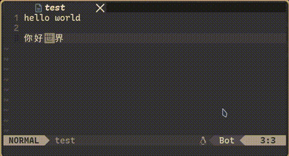
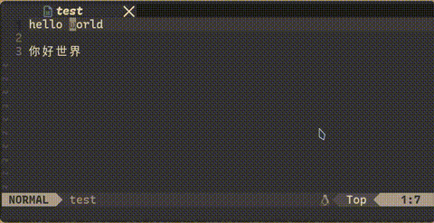

# fcitx5-switcher.nvim
A neovim plugin, automatically activate/inactivate fcitx5 in certain conditions.   
- Feat 1: When the character in front of the cursor is a Chinese character (Unicode 4E00-9FFF), it will automatically activate fxitx5 when you enter insert mod at this time.
  
- Feat 2: Press a configurable key to enter the insert mod and automatically activate fcitx5.  
  
### Installation
Using [lazy.nvim](https://github.com/folke/lazy.nvim)
~~~lua
require("lazy").setup({
  "puddings233/fcitx5-switcher.nvim",
  config = function()
    require("fcitx5-switcher-custom").setup({
      enable_manual = false,
      key = "nil",
      mod = "nil"
    })
  end
})
~~~
### Configuration
~~~lua
require("fcitx5-switcher-custom").setup({
  -- enables or disables feat 2, accepts ‘true’, ‘false’.
  enable_manual = false,
  -- key for function 2
  key = "nil",
  -- insert mod entry method, accepts ‘i’, ‘a’.
  -- "i" is equivalent to pressing i and then activate fcitx5, "a" is the same.
  mod = "nil"
})
~~~
## zh
一个 neovim 插件，在特定条件下自动将 Fcitx5 输入法更改为中文输入法。
- 功能1：当光标前的字符为中文字符（Unicode 4E00-9FFF）时，此时进入 insert mod 时，将自动切换为中文输入法。  
  
- 功能2：按下一个可以配置的按键，进入 insert mod 并自动切换为中文输入法。  
  
### Inspiration
[Video](https://www.bilibili.com/video/BV1U94y1e7HS)
